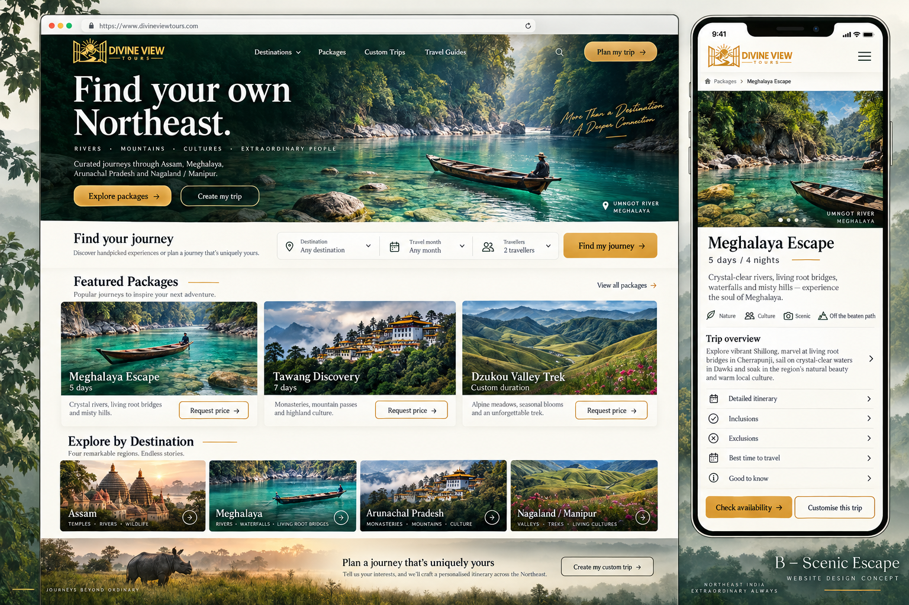

# Divine View Tours — Design B: Scenic Escape

Website design and implementation brief · Version 1.0

## 1. Purpose and reference

Create an inviting, scenic travel website for people exploring Northeast India, comparing suggested holidays, and arranging a custom trip. The website should help visitors move from inspiration to a clear itinerary, an agreed price, and a confirmed booking.

**Selected direction:** Design B — Scenic Escape. Preserve its large scenic hero, cream backgrounds, forest-green brand colour, warm gold actions, editorial headings and simple trip finder.



The image above is the visual direction, not a finished interface specification. The requirements below take priority where the generated sample omits functionality or contains illustrative content. This brief specifies a future website; no live booking, payment or search system is implied by the mockup.

### Brand information supplied

- Name: Divine View Tours
- Website: divineviewtours.com
- Phone / WhatsApp: +91 60265 04087
- Primary departure base: Guwahati
- Core destinations: Assam, Meghalaya and Arunachal Pradesh
- Additional experience: Dzukou Valley trek, clearly labelled Nagaland / Manipur
- Use the original approved logo artwork for production.

## 2. Experience principles

1. Let scenery create interest; let clear information make booking easy.
2. Provide two prominent choices: **Explore packages** and **Create my trip**.
3. Support visitors who know their destination and those who need help choosing.
4. Show what a trip includes before requesting contact details.
5. Distinguish full holiday packages, vehicle hire and trekking arrangements.
6. Present an enquiry as a request, and a booking as confirmed only after the required checks and payment.
7. Design for mobile first, especially visitors arriving from search or WhatsApp.

## 3. Visual system

### Colour palette

These are implementation starting values inspired by the selected image, not sampled official brand specifications. Check text contrast in the final interface.

| Token | Value | Use |
| --- | --- | --- |
| Forest | `#103F36` | Navigation, headings, secondary buttons, footer |
| Deep forest | `#082D27` | Hero overlays and dark surfaces |
| Cream | `#F7F3E9` | Main page background |
| Paper | `#FFFDF7` | Cards, forms and booking summary |
| Gold | `#D9A441` | Primary actions and restrained highlights |
| Gold hover | `#C18D2D` | Hover state for gold buttons |
| Ink | `#172C26` | Body text and text on gold buttons |
| Muted ink | `#59665E` | Secondary information |
| Divider | `#DEDCCD` | Borders and separators |

- Gold buttons use dark text. Do not assume white text on gold has sufficient contrast.
- Use white or cream text over photographs only with a sufficient dark overlay.
- Reserve gold for important actions and small accents.
- Default to a light theme with dark hero and footer sections.

### Typography

- Headings: **Cormorant Garamond**, medium or semibold; fallback Georgia, serif.
- Body, navigation, forms and buttons: **Inter**, regular and medium; fallback system sans-serif.
- Desktop hero heading: approximately 64–80px, tight but readable line spacing.
- Mobile hero heading: approximately 40–48px, adjusted to avoid awkward wrapping.
- Section headings: 32–44px desktop; 28–34px mobile.
- Body text: 16–18px with approximately 1.55–1.7 line height.
- Secondary labels: 13–14px; avoid shrinking important content to fit.
- Use sentence case for navigation and buttons. Use uppercase only for short labels.
- A handwritten accent may appear once in a large scenic section. Do not use it for instructions, prices or important information.

### Layout and components

- Desktop content width: approximately 1200–1280px, centred.
- Desktop page padding: 32–48px; mobile: 20px.
- Spacing scale: 4, 8, 12, 16, 24, 32, 48, 64 and 96px.
- Section spacing: 64–96px desktop; 40–56px mobile.
- Card corners: approximately 10–14px; subtle shadows and thin borders.
- Buttons: approximately 48px minimum height, generous horizontal padding.
- Primary buttons: gold fill, dark text, lightly rounded corners.
- Secondary buttons: forest-green outline on light surfaces; cream outline over dark photography.
- Use one consistent outline icon family. Icons supplement visible labels.
- Avoid excessive badges, heavy shadows, decorative counters and competing animations.

### Photography and motion

- Lead with a wide Meghalaya river photograph, with a boat, greenery and room for text on the left.
- Use real, licensed or owned destination photographs in production.
- Supporting subjects: Kamakhya Temple, Assam wildlife, Meghalaya waterfalls, Tawang and Dzukou Valley.
- Verify captions and locations. Generated sample scenery is not evidence of what a location looks like.
- Preserve natural colour and believable seasonal conditions.
- Use a strong static hero image at launch; video is optional only if performance permits.
- Keep transitions subtle, approximately 150–250ms. Respect reduced-motion preferences.
- Avoid autoplay carousels, scroll hijacking and motion behind essential text.

## 4. Navigation and information architecture

**Desktop navigation:** Logo · Destinations · Packages · Custom Trips · Travel Guides · Plan my trip

**Destinations menu:** Assam · Meghalaya · Arunachal Pradesh · Dzukou Valley Trek

**Secondary/footer links:** Vehicle Hire · About Us · Contact · Booking Terms · Cancellation Policy · Privacy

Suggested page structure:

```text
/
├── destinations/
│   ├── assam/
│   ├── meghalaya/
│   ├── arunachal-pradesh/
│   └── dzukou-valley/
├── packages/
│   ├── meghalaya-5-day-tour-from-guwahati/
│   ├── tawang-7-day-tour-from-guwahati/
│   ├── kaziranga-tour-from-guwahati/
│   └── dzukou-valley-trek/
├── custom-trip/
├── vehicle-hire/
├── travel-guides/
├── about/
├── contact/
├── booking-terms/
├── cancellation-policy/
└── privacy/
```

Package names and durations are proposed editorial examples. Publish only itineraries the business can actually supply. Confirm Dzukou departure point and duration separately.

## 5. Homepage layout

### A. Header and scenic hero

- Place the logo and navigation over the dark upper area of the hero.
- Use a solid forest background when the sticky navigation moves beyond the hero.
- Hero height: approximately 540–660px desktop; adapt to content on mobile.
- Apply a left-to-right dark overlay to retain both readable text and visible scenery.
- Keep both main actions visible without requiring visitors to find the menu.

**Suggested copy**

> Find your own Northeast.
>
> Thoughtfully planned journeys through Assam, Meghalaya and Arunachal Pradesh, with Dzukou Valley trekking experiences.
>
> Explore packages · Create my trip

Include a small, accurate photograph caption such as “Umngot River, Meghalaya” only when verified against the actual image.

### B. Trip finder

Place a cream search strip immediately below the hero.

- Destination, including “Help me choose”.
- Travel month, including “Flexible”.
- Number of travellers.
- Button: **Find my journey**.

The finder returns relevant suggested packages. It does not imply live hotel or vehicle availability. Preserve selected preferences when the visitor opens a package or submits an enquiry.

If nothing matches, show a friendly explanation, related alternatives and **Create my trip**. Never return an unexplained empty section.

### C. Featured packages

Use three cards across on desktop, two on tablet and a vertical list on mobile.

Each card includes:

- Destination photograph and package name.
- Days and nights, when confirmed.
- Short description and main places covered.
- Confirmed price with its basis, or **Request price**.
- Primary link: **View itinerary**.

Initial examples: Meghalaya Escape, Tawang Discovery and Dzukou Valley Trek. Add Assam wildlife when its itinerary is ready.

Do not apply the existing per-vehicle daily fares as per-person holiday prices.

### D. Explore by destination

Four scenic cards: Assam, Meghalaya, Arunachal Pradesh and Dzukou Valley Trek. Label the trek’s location clearly; do not imply it belongs to one of the other three states.

Each card opens a useful destination page with highlights, travel considerations and relevant packages.

### E. Custom-trip invitation

Use a wide landscape photograph with a restrained cream or dark overlay.

> Plan a journey that’s uniquely yours.
>
> Tell us where you want to go, how you like to travel and what matters most.
>
> Create my trip

### F. People and trust

- Introduce the actual team and local operating experience.
- Include real team and trip photographs.
- Show genuine reviews with their source, when available.
- Explain how planning and support work using commitments the business can fulfil.
- Do not invent review scores, guest counts, awards or guarantees.

### G. Travel guides

Show three useful articles with a photograph, clear title and short description. Examples: Meghalaya seasonal planning, planning a Tawang road trip, and preparing for a Dzukou trek.

### H. Footer

Include contact details, destination links, packages, vehicle hire, policies and a WhatsApp action. Add a real business address only when supplied and verified. Avoid adding a newsletter form unless there is a plan to operate it.

## 6. Package listing and detail pages

### Package listing

- Filters: destination, duration, travel style and budget where actual pricing supports it.
- Show results count and a clear reset action.
- Provide meaningful empty and loading states.
- Keep filters in a collapsible panel on mobile.
- Offer a custom-trip route for visitors who cannot find a suitable package.

### Package detail layout

Desktop: main content on the left and a booking/enquiry summary on the right. Mobile: a single column with a persistent bottom action area.

Content order:

1. Breadcrumbs, gallery, package title and destination.
2. Duration, pickup/drop point, travel style and short overview.
3. Trip highlights and route summary.
4. Day-by-day itinerary, including realistic driving estimates and overnight stops.
5. Stay category and vehicle options.
6. Inclusions and exclusions.
7. Price basis, relevant seasonal conditions and optional extras.
8. Practical information: season, permits, walking requirements and accessibility considerations.
9. Payment and cancellation terms.
10. FAQs and related trips.

**Primary action:** Check availability

**Secondary action:** Customise this trip

Show confirmed prices transparently. For example, a per-person starting price must state the group size, room-sharing arrangement and other conditions behind it. Use “Request price” until actual package costing is approved.

Arunachal pages should explain applicable permit and local-vehicle arrangements using current verified information. Trek pages should state the departure point, expected walking, accommodation arrangements and what support is included.

## 7. Suggested-package booking flow

```text
Search, destination page or homepage
  → Package details
  → Check availability
  → Dates, travellers, pickup and preferences
  → Contact details and request summary
  → Request received
  → Team checks availability and prepares final quote
  → Customer reviews itinerary, inclusions and terms
  → Customer accepts and pays required deposit
  → Booking confirmed with reference and trip details
```

- Do not require an account for browsing or submitting an enquiry.
- Confirm submission on screen with a reference and a summary.
- Show a response-time commitment only after the business approves it.
- Store enquiries in a manageable team inbox or CRM; a WhatsApp button alone is not an enquiry-management system.
- Preserve each enquiry’s package, selected options and acquisition source.
- Show the final price, payment amount and cancellation terms before payment.
- Use a hosted payment provider. Verify successful payment on the server and avoid duplicate processing.
- Do not mark a booking confirmed solely because a browser returns to a success page.
- Failed or abandoned payment should provide a safe retry route while preserving the quote.

## 8. Custom-trip planner

Use four short steps with progress, Back and Continue controls. Preserve entries while navigating.

| Step | Fields and behaviour |
| --- | --- |
| 1. Where and when | Destination interests, dates or flexible month, number of days; allow “Help me choose” |
| 2. Your group | Adults, children and ages where needed, pickup location |
| 3. Your travel style | Interests, pace, stay preference, total group budget or “Help me estimate”, optional requests |
| 4. Review and send | Editable trip summary, name and preferred contact method; collect only the contact details needed |

- Ask whether the budget covers the land arrangement or includes flights.
- Keep personal preferences optional where possible.
- Prefill itinerary and duration when someone selects **Customise this trip** from a package.
- Do not collect identity documents or payment details during initial discovery.
- Provide a concise privacy explanation next to submission.
- Do not show an instant fixed price without an implemented and validated pricing system.

```text
Create my trip / Customise this trip
  → Four-step planner
  → Request received
  → Proposed itinerary and quote
  → Customer feedback and revisions
  → Availability reconfirmed and quote accepted
  → Deposit
  → Booking confirmed
```

## 9. Mobile and accessibility

- Stack the hero copy, actions and trip finder without horizontal scrolling.
- Keep both **Explore packages** and **Create my trip** readily visible.
- Use a simple menu with clearly labelled destination and package links.
- On package pages, keep **Check availability** and **Customise this trip** at the bottom; reserve content space so the bar covers nothing.
- WhatsApp should never overlap the booking controls, form fields or keyboard.
- Use semantic headings, actual links for navigation and buttons for actions.
- Provide visible keyboard focus, proper form labels and inline errors.
- Aim for WCAG 2.2 AA contrast and usability, including at least 4.5:1 contrast for normal text.
- Use generous touch targets, normally at least 44 × 44px.
- Galleries and accordions must work with keyboard and screen readers.
- Do not rely on colour, hover or animation to communicate essential information.
- Ensure layouts remain usable at narrow widths and with enlarged text.

## 10. SEO and organic discovery

The design must support search discovery through useful, accessible content. SEO is an ongoing activity; neither this design nor implementation guarantees rankings or enquiries.

### Content structure

- Give each destination and genuine package a dedicated, crawlable page.
- Target distinct search intentions rather than publishing repetitive pages with changed place names.
- Keep package descriptions, itinerary, inclusions and FAQs readable without submitting a form.
- Link travel guides to relevant destinations and packages, and link packages back to practical guides.
- Explain first-hand local details: realistic timings, route choices, seasonal tradeoffs and operating arrangements.
- Attribute advice to real people and show review/update dates when the information has actually been checked.
- Avoid claiming guaranteed sightings, river clarity, snow or access.

Proposed search themes, to validate through keyword research and Search Console:

| Page | Search intention |
| --- | --- |
| Meghalaya destination/packages | Meghalaya tour packages from Guwahati |
| Five-day Meghalaya itinerary | 5 day Meghalaya tour itinerary |
| Tawang package | Tawang tour package from Guwahati |
| Assam wildlife package | Kaziranga tour from Guwahati |
| Dzukou package | Dzukou Valley trek package |
| Vehicle hire | Guwahati private car hire |

### Technical requirements

- Render essential page content in HTML available to search engines.
- Use unique titles, useful meta descriptions, descriptive URLs and logical headings.
- Provide canonical URLs and an XML sitemap; manage filter variants to avoid duplicate indexable pages.
- Keep navigation and internal links crawlable.
- Optimise and responsively size photographs; reserve image dimensions to reduce layout shift.
- Prioritise the hero image and lazy-load suitable below-the-fold images.
- Use accurate image descriptions and useful filenames; do not stuff keywords.
- Add appropriate structured data, such as Organization/TravelAgency and BreadcrumbList, only where supported by visible factual content. It does not guarantee a rich result.
- Connect Search Console and monitor indexing, mobile performance and important landing pages.
- If replacing an existing website, audit its URLs and preserve valuable pages or add suitable permanent redirects.

### Local discovery and measurement

- Maintain an accurate Google Business Profile and consistent contact information.
- Ask actual customers for genuine reviews after travel.
- Measure package views, enquiry starts, completed requests, WhatsApp/call clicks and confirmed bookings.
- Connect enquiries to their traffic source where practical; a WhatsApp click is not itself a booking.
- Use search and enquiry data to decide which guides and packages to improve next.

Reference guidance:

- [Google SEO Starter Guide](https://developers.google.com/search/docs/fundamentals/seo-starter-guide)
- [Creating helpful, reliable, people-first content](https://developers.google.com/search/docs/fundamentals/creating-helpful-content)
- [Google Business Profile: improving local ranking](https://support.google.com/business/answer/7091?hl=en)

## 11. Launch scope and production inputs

### Initial scope

- Homepage following Design B.
- Four destination/experience pages.
- Package listing and four to six fully developed package pages.
- Four-step custom-trip planner and enquiry management.
- Vehicle-hire page using approved rates and explicit units.
- About, contact and policy pages.
- A small set of original, useful travel guides.
- Availability review, quotes, deposit payment and booking confirmation workflow.

### Inputs needed before publication

- Original logo and approved brand assets.
- Rights-cleared destination and team photographs.
- Confirmed itineraries, package pricing basis, inclusions and exclusions.
- Actual hotel/stay categories, vehicle options and availability process.
- Booking, deposit, cancellation and refund policies.
- Team contact routing and approved response expectations.
- Payment-provider setup and live payment verification.
- Genuine review content and permission to use customer photographs.
- Existing-site URL audit and domain/hosting access for implementation.

Do not publish placeholder prices, fabricated testimonials, unverified photographs or mock booking confirmations.

## 12. Acceptance checklist

- The site recognisably follows Design B: scenic hero, forest green, cream, gold actions and editorial typography.
- A new visitor can find a suggested package or start a custom trip from the first screen.
- Every package clearly states its duration, route, inclusions, exclusions and price basis or quote requirement.
- Customising a package carries its information into the planner.
- Forms preserve entries, validate clearly and return an accurate request receipt.
- Availability, payment and confirmation states match actual operational events.
- Mobile actions remain visible without obscuring content.
- Key content is accessible, crawlable and linked through the site.
- All photographs, contact details, prices, policies and claims are verified before launch.
- Enquiries reach the team and can be traced through to a confirmed booking.
