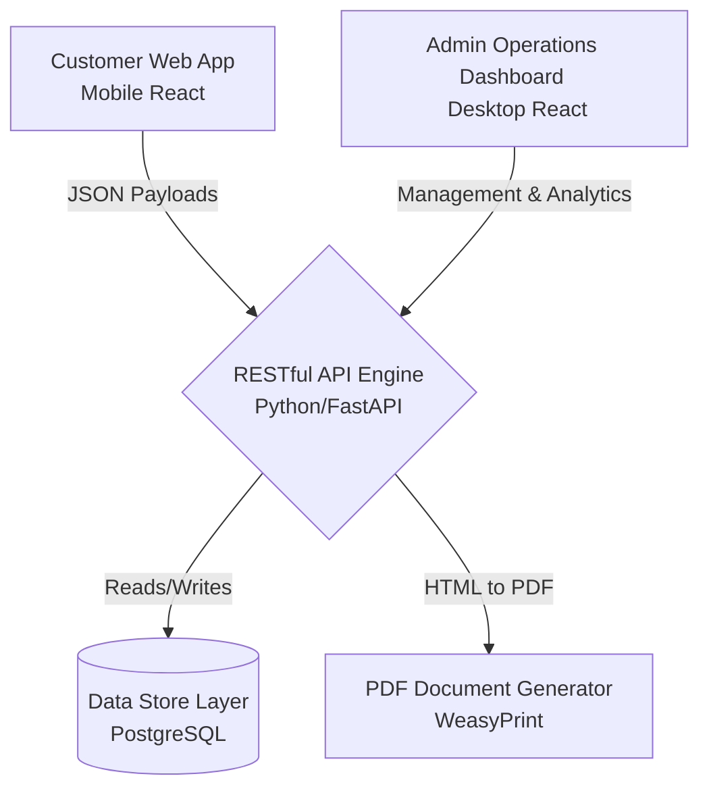

# Divine View Tours: Automated Trip Intake & Inventory Router
**System Flow & Technical Details Document**

---

## 1. Executive Summary

The **Divine View Tours Automated Trip Intake & Inventory Router** is a targeted web application designed to convert high-footfall hotel guests (specifically at Hotel Divine View, Guwahati) into customized tour package sales. By utilizing physical QR codes within the hotel, the system achieves a near-zero Customer Acquisition Cost (CAC). 

The core value proposition for budget-conscious travelers is the **"Pool & Save"** mechanism, which allows multi-day cab bookings to be shared among different parties checking out on the same date, significantly reducing individual transport costs.

---

## 2. Customer Journey Flow (Frontend Web App)

The customer-facing application is a mobile-first, friction-free questionnaire built with React and Tailwind CSS.

### **Step 1: Acquisition & Entry**
* **Trigger:** Guest scans a QR code placed in their hotel room or the reception area.
* **Action:** Guest is directed to the mobile-optimized `Welcome` screen of the web app.

### **Step 2: Intake & Preferences (`TripBuilder.jsx`)**
To prevent cognitive overload, the interface uses single-input views and numeric increment controls (instead of typing numbers).
* **Basic Info:** Guest Name, WhatsApp Number.
* **Trip Parameters:** Check-in Date, Duration (3-7 days), Traveler Count.
* **Vibe Selection:** 
  * *Classic Circuit:* Shillong Peak, Elephant Falls, local highlights.
  * *Adventure & Camping:* Double Decker Root Bridges, Mawryngkhang, Shnongpdeng river camping.
  * *Relaxed Circuit:* Slow-paced local sightseeing and cultural highlights.
* **Budget Strategy:** Guest selects between standard booking or the **"Pool & Save"** toggle to share rides.

### **Step 3: Real-time Calculation & Presentation (`ItineraryView.jsx`)**
* **Action:** The system passes inputs to the backend calculation engine.
* **Result:** The user is presented with dynamic preview cards showing their customized itinerary and an estimated cost (incorporating pooled savings if selected).

### **Step 4: Conversion & Call to Action**
The preview screen offers two primary actions:
1. **WhatsApp Handoff:** An auto-generated link (`https://wa.me/...`) pre-filled with their trip details to connect directly with the sales team.
2. **Download Itinerary:** A button that hits a backend endpoint to generate and download a real-time, localized PDF of their trip details.

---

## 3. Operations & Admin Flow (Desktop Dashboard)

The Admin Dashboard provides the hotel staff and dispatchers with the tools to manage leads and fleet inventory.

### **View A: Pipeline Overview (Kanban Board)**
Leads automatically flow into a Kanban board matching the database workflow stages:
1. **New Lead:** Guest has completed the questionnaire.
2. **Negotiating:** Staff is communicating with the guest via WhatsApp.
3. **Token Paid:** Guest has confirmed and paid a deposit.
4. **Fully Dispatched:** Trip is confirmed, and a vehicle/driver is assigned.
* *Features:* One-click buttons to send automated WhatsApp/SMS notifications to travelers and drivers.

### **View B: Fleet Allocation Matrix**
* **Purpose:** To manage the physical vehicle inventory and optimize the "Pool & Save" feature.
* **Features:** 
  * A schedule grid showing all active vehicles in the pool (Hatchback, Sedan, SUV).
  * A text search layout allowing dispatchers to find cross-matching parties (e.g., two couples looking to travel to Meghalaya on the same date) and assign them to a shared SUV, maximizing profit margins and fulfilling the budget promise.

---

## 4. System Architecture

### **Tech Stack**
* **Frontend (Customer & Admin):** React.js + Tailwind CSS (Optimized for speed and layout flexibility).
* **Backend Engine:** Python (FastAPI or Flask) to handle logic, dynamic pricing, and routing.
* **Database:** PostgreSQL for robust relational data management.
* **Document Processing:** WeasyPrint / ReportLab (Python) to inject data into HTML/CSS templates for instant PDF creation.

---

## 5. Database Schema & Data Models (PostgreSQL)

The database links customer leads directly to available network inventory.

**1. Leads Table:** 
Captures customer inputs and intent.
* Fields: `id`, `guest_name`, `whatsapp_number`, `check_in_date`, `trip_days`, `traveler_count`, `vibe` (enum: classic, adventure, relaxed), `strategy` (enum: pool, value), `estimated_cost_inr`, `created_at`.

**2. Drivers Table:**
Manages the network of available vehicles.
* Fields: `id`, `driver_name`, `phone`, `vehicle_type` (Hatchback, Sedan, SUV), `is_available`.

**3. Bookings Table:**
The operational tracker connecting leads to drivers.
* Fields: `id`, `lead_id` (FK), `driver_id` (FK), `hotel_status`, `payment_token_received` (boolean), `workflow_stage` (New Lead, Negotiating, Token Paid, Dispatched).

---

## 6. Implementation Roadmap

* **Phase 1: Component MVP**
  * Setup local development hierarchy.
  * Build Customer UI (`TripBuilder`, `ItineraryView`) with mock data.
  * Ensure perfect mobile responsiveness.
* **Phase 2: Hook Automation & Document Pipeline**
  * Develop Python backend API.
  * Connect frontend inputs to PostgreSQL database.
  * Implement PDF generation pipeline.
* **Phase 3: Admin Dashboard & Deployment**
  * Build the Kanban and Fleet Matrix dashboard for staff.
  * Deploy to production infrastructure with SSL.
